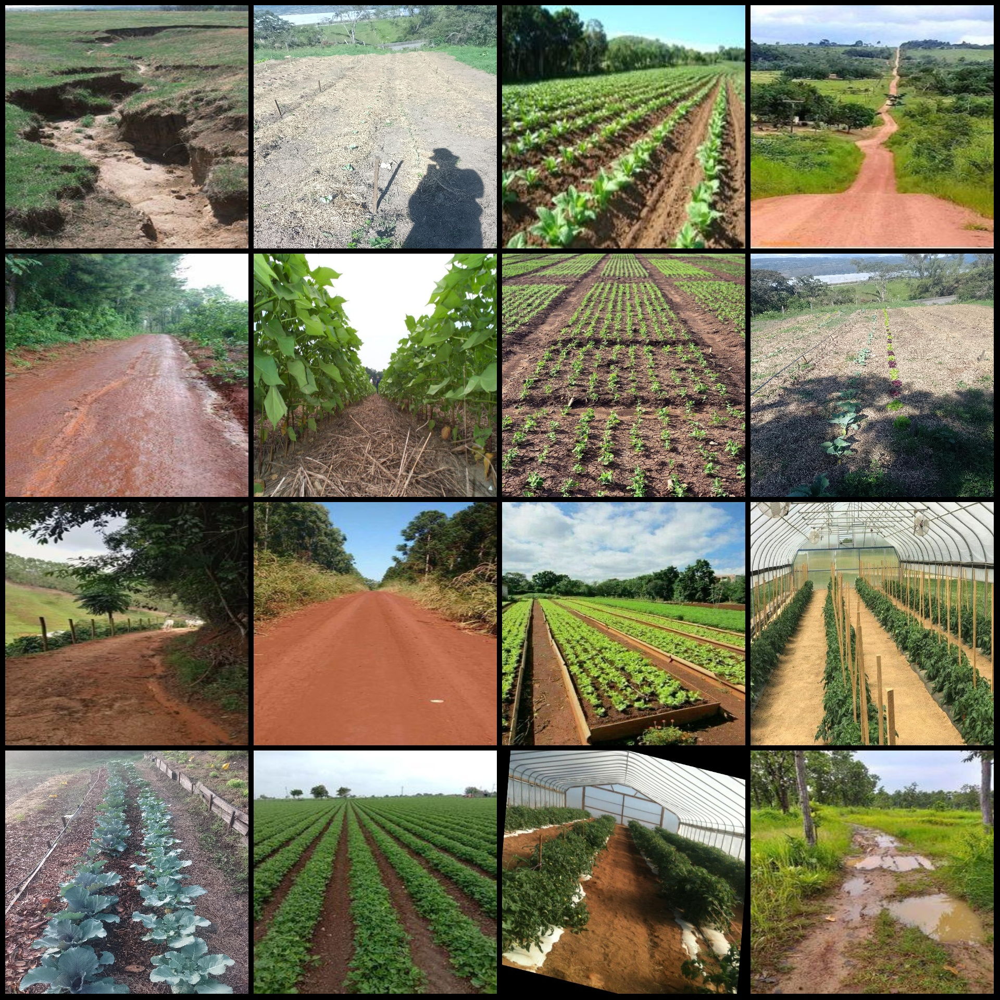
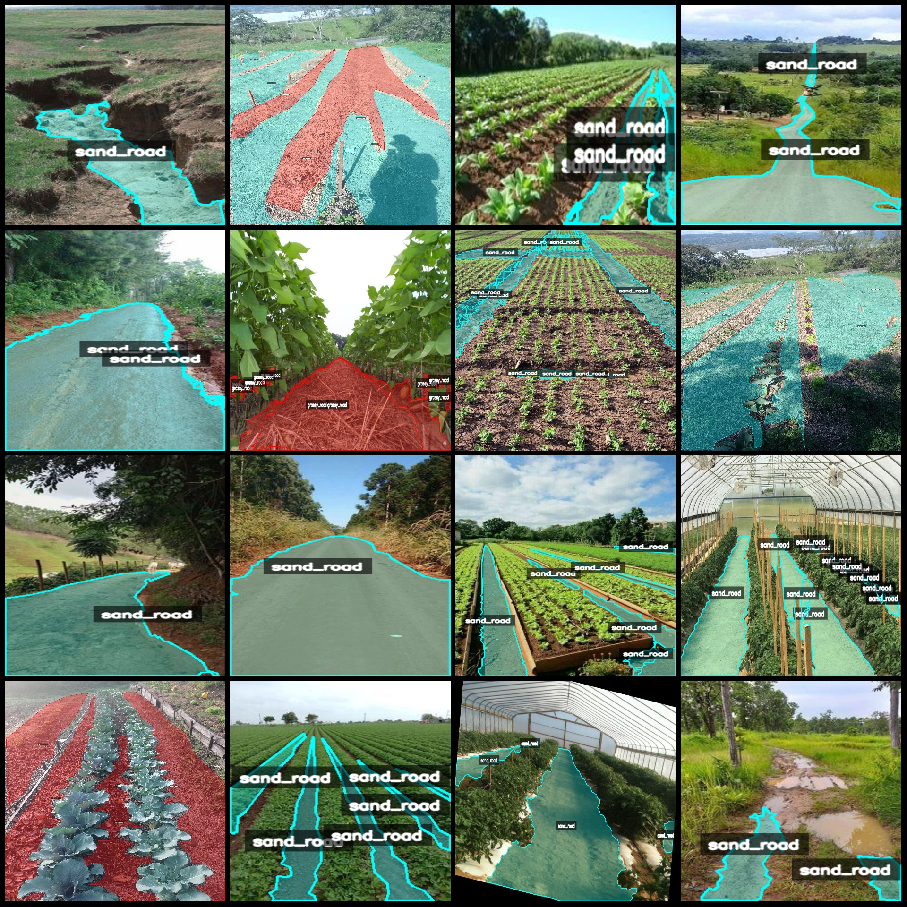
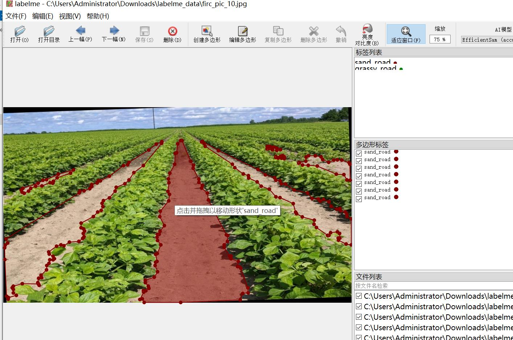

# Intelligent Agricultural Crop Robot Road Recognition and Grass/Sand Road Segmentation Dataset in LabelMe Format with 211 Images in 2 Classes

The dataset format is labeledME format (excluding the mask file, only containing jpg images and corresponding json files).  
Number of images (the number of jpg files): 211  
Number of annotations (json file count): 211  
Number of annotation categories: 2  
Annotation category names: ["grassy_road", "sand_road"]  
Number of boxes per category:  
grassy_road count = 197  
sand_road count = 836  
Total box count: 1033  
Annotation tool used: labelme=5.5.0  
Image resolution: Multi-resolution images, such as 1280x720, 640x1136, etc.  
Annotation rule: Polygons are drawn around categories.  
Important note: The dataset can be edited using labelme. For the json dataset, it needs to be converted to a mask or YOLOF/COCO format for semantic segmentation or instance segmentation.  
Special declaration: This dataset does not guarantee the accuracy of the trained model or weight files.  
Image preview:  
Annotation example:  
Randomly selected 16 images:  
Annotation drawing result:  
Labelme editing image example:

## Images

Here is a pay link on Stripe ( https://buy.stripe.com/3cs8yP7sY87d0vu9AB ). Please contact me lonlonago@foxmail.com after funding $89, and I will send you a complete data files , thank you!

